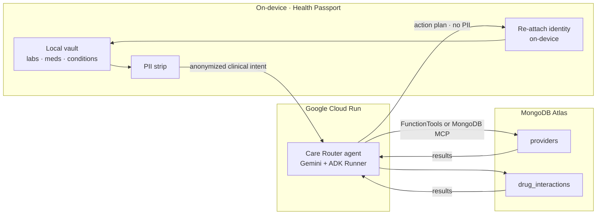
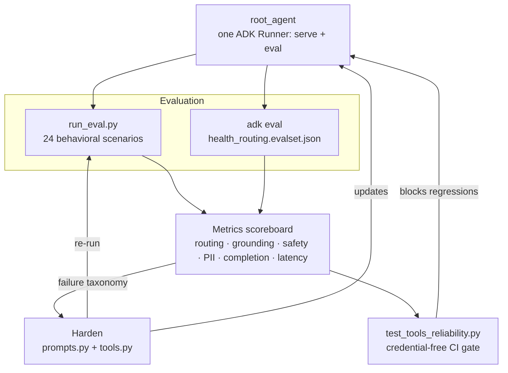

# Architecture — Soma Care Router

Two views: the **Privacy Bridge** (how a request flows without PII reaching the cloud) and the **Optimization & Evaluation loop** (the Track 2 reliability work). For the Devpost upload, export either panel to PNG at [mermaid.live](https://mermaid.live), or screenshot `deck/architecture.html`.

## Panel 1 — The Privacy Bridge

Your data stays local. Actions happen in the cloud. Only a de-identified clinical intent ever leaves the device; the returned plan has identity re-attached on-device.

## Panel 2 — Optimization & Evaluation loop (Track 2)

One agent definition (`root_agent`) is served and evaluated through the same ADK `Runner`, so we test exactly what we ship. Evaluation drives hardening; a credential-free test gate blocks regressions.

## Legend
- **FunctionTools path** (default): hardened, deterministic tools in `agent/tools.py`. This is the path the scoreboard measures.
- **MongoDB MCP path** (`USE_MONGODB_MCP=1`): the read-only MongoDB MCP server via ADK `MCPToolset` in `agent/mcp_tools.py`. Same Atlas data, native MCP.
- The before/after numbers and the full failure taxonomy live in [eval/RESULTS.md](eval/RESULTS.md).
